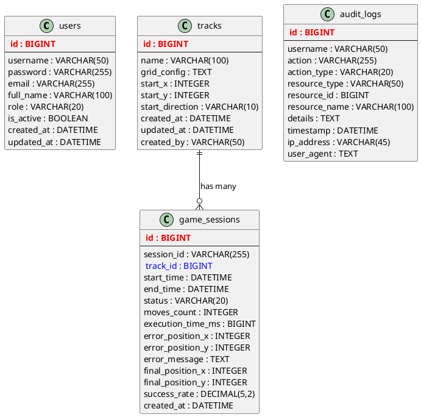

# Diagrama ER - Game for Devs

## Entidades y Relaciones

### 1. **USERS**
```
┌─────────────────┐
│ USERS           │
├─────────────────┤
│ PK: id (BIGINT) │
│    username     │
│    password     │
│    email        │
│    full_name    │
│    role         │
│    is_active    │
│    created_at   │
│    updated_at   │
└─────────────────┘
```

### 2. **TRACKS**
```
┌──────────────────┐
│ TRACKS           │
├──────────────────┤
│ PK: id (BIGINT)  │
│    name          │
│    grid_config   │
│    start_x       │
│    start_y       │
│    start_direction│
│    created_at    │
│    updated_at    │
│    created_by    │
└──────────────────┘
```

### 3. **GAME_SESSIONS**
```
┌──────────────────────┐
│ GAME_SESSIONS        │
├──────────────────────┤
│ PK: id (BIGINT)      │
│    session_id        │
│ FK: track_id         │
│    start_time        │
│    end_time          │
│    status            │
│    moves_count       │
│    execution_time_ms │
│    error_position_x  │
│    error_position_y  │
│    error_message     │
│    final_position_x  │
│    final_position_y  │
│    success_rate      │
│    created_at        │
└──────────────────────┘
```

### 4. **AUDIT_LOGS**
```
┌─────────────────┐
│ AUDIT_LOGS      │
├─────────────────┤
│ PK: id (BIGINT) │
│    username     │
│    action       │
│    action_type  │
│    resource_type│
│    resource_id  │
│    resource_name│
│    details      │
│    timestamp    │
│    ip_address   │
│    user_agent   │
└─────────────────┘
```

## Relaciones

### TRACKS ←→ GAME_SESSIONS
- **Relación**: 1:N (One-to-Many)
- **FK**: `game_sessions.track_id` → `tracks.id`
- **Descripción**: Una pista puede tener múltiples sesiones de juego

## Enums

### Role (USERS)
- ADMIN
- USER (si se implementa)

### GameStatus (GAME_SESSIONS)
- IN_PROGRESS
- SUCCESS
- COLLISION
- OUT_OF_BOUNDS
- TIMEOUT

### ActionType (AUDIT_LOGS)
- CREATE
- UPDATE
- DELETE
- LOGIN
- LOGOUT

## Comandos para generar diagrama automáticamente

### Opción A: Usando MySQL Workbench
```sql
-- Si usas MySQL, conecta MySQL Workbench y usa:
-- Database > Reverse Engineer
```

### Opción B: Usando DBeaver
```
1. Conectar a la base de datos
2. Clic derecho en el esquema
3. Generate ER Diagram
```

### Opción C: Usar SchemaSpy (Java)
```bash
# Instalar SchemaSpy
# Generar diagrama HTML interactivo
java -jar schemaspy.jar -t mysql -host localhost -db gamefordevs -u root -p password -o ./schema-output
```

### Opción D: Usando PlantUML
Crear archivo `database.puml`:


## Herramientas recomendadas por orden de facilidad:

1. **Draw.io** - Más fácil y gratuito
2. **DBeaver** - Si ya tienes la BD corriendo
3. **MySQL Workbench** - Si usas MySQL
4. **PlantUML** - Para diagrama como código
5. **SchemaSpy** - Para documentación completa